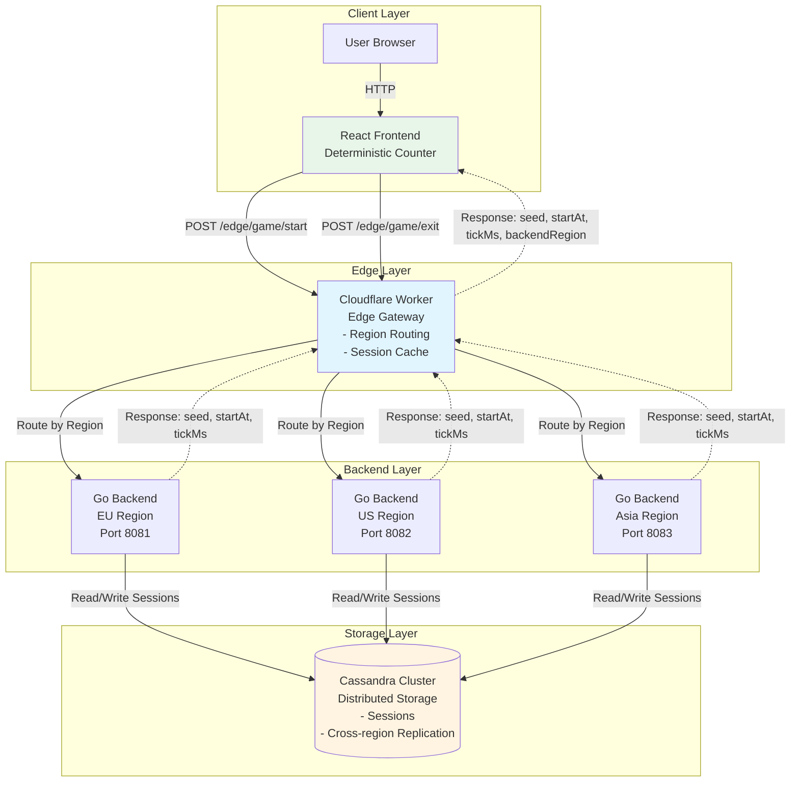
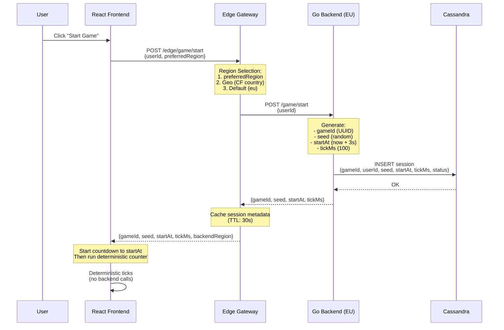

# Distributed Game System Architecture

## Title & Summary

A **multi-region, edge-optimized game backend** that enables synchronized deterministic gameplay across global players using seed-based pseudo-random algorithms. The system consists of a React frontend, a Cloudflare Workers edge gateway for intelligent routing, stateless Go backend services deployed across multiple regions (EU, US, Asia), and Apache Cassandra as the shared distributed storage layer. The core innovation is **client-side deterministic execution**: instead of streaming every game tick from the backend, the system distributes a seed and synchronized start time, allowing clients to independently compute identical game states while reducing backend load by orders of magnitude.

---

## High-Level Architecture Overview

The system is designed around four main layers:

1. **Frontend (React)**: Browser-based UI that calls edge endpoints and runs deterministic game logic locally using seed/startAt/tickMs parameters.

2. **Edge Gateway (Cloudflare Workers)**: Runs at 300+ global points of presence, routes requests to appropriate backend regions based on geography/user preference, and caches session metadata to reduce backend load.

3. **Go Backend Services (Multi-Region)**: Stateless HTTP services deployed in EU, US, and Asia regions. Each instance handles session creation/termination and delegates persistence to Cassandra.

4. **Cassandra Cluster**: Shared distributed database that stores all game sessions, providing durability, horizontal scalability, and cross-region replication.

**Data Flow**: User request → Edge Gateway (routing decision) → Regional Go Backend → Cassandra (persistence) → Response with seed/startAt/tickMs → Frontend (deterministic execution).

---

## Architecture Diagram



### Sequence Diagram: Start Game Flow



---

## Request Flows

### Start Game Flow

1. **User Action**: User enters userId and clicks "Start Game" in React frontend.

2. **Frontend → Edge**: Frontend sends `POST /edge/game/start` with:
   ```json
   {
     "userId": "user123",
     "preferredRegion": "eu"  // optional
   }
   ```

3. **Edge Gateway Processing**:
   - **Region Selection**: Determines target backend region using:
     - Priority 1: `preferredRegion` if provided and valid
     - Priority 2: `x-user-region` header
     - Priority 3: Geographic routing (Cloudflare country code → region mapping)
     - Priority 4: Default region (e.g., "eu")
   - **Caching Check**: Optionally checks in-memory cache for recent sessions (not applicable for start)

4. **Edge → Backend**: Edge forwards request to selected regional Go backend:
   ```
   POST https://eu.api.example.com/game/start
   { "userId": "user123" }
   ```

5. **Backend Processing**:
   - **Generate Game Parameters**:
     - `gameId`: UUID v4
     - `seed`: Cryptographically secure random integer
     - `startAt`: `Date.now() + 3000` (3 seconds in future for countdown)
     - `tickMs`: 100 (milliseconds between ticks)
   - **Create Session**: Calls `SessionRepository.CreateSession()` with session data

6. **Backend → Cassandra**: 
   ```sql
   INSERT INTO game_backend.sessions 
   (session_id, user_id, region, seed, start_at, tick_ms, status, started_at)
   VALUES (?, ?, ?, ?, ?, ?, 'active', ?)
   ```

7. **Cassandra → Backend**: Acknowledges write (QUORUM consistency)

8. **Backend → Edge**: Returns game parameters:
   ```json
   {
     "gameId": "abc-123-def",
     "seed": 987654321,
     "startAt": 1733850000000,
     "tickMs": 100
   }
   ```

9. **Edge Caching**: Edge stores session metadata in memory cache:
   ```typescript
   cache.set({
     gameId: "abc-123-def",
     seed: 987654321,
     startAt: 1733850000000,
     tickMs: 100,
     backendRegion: "eu",
     cachedAt: Date.now()
   })
   ```

10. **Edge → Frontend**: Returns response with `backendRegion` added:
    ```json
    {
      "gameId": "abc-123-def",
      "seed": 987654321,
      "startAt": 1733850000000,
      "tickMs": 100,
      "backendRegion": "eu"
    }
    ```

11. **Frontend Execution**:
    - **Countdown**: Shows countdown until `startAt` timestamp
    - **Deterministic Counter**: When `Date.now() >= startAt`, starts local counter that:
      - Calculates `step = floor((now - startAt) / tickMs)`
      - Uses `deterministicRNG(seed, step)` to decide increments/breaks
      - Updates UI every `tickMs` milliseconds
    - **No Backend Calls**: Counter runs entirely client-side

### Exit Game Flow

1. **User Action**: User clicks "Exit Game" in React frontend.

2. **Frontend → Edge**: Sends `POST /edge/game/exit`:
   ```json
   {
     "gameId": "abc-123-def",
     "userId": "user123",
     "backendRegion": "eu"  // optional if cached
   }
   ```

3. **Edge Gateway Processing**:
   - **Region Resolution**: 
     - If `backendRegion` provided → use it
     - Else → lookup in cache by `gameId`
     - Else → return 400 error (region required)
   - **Cache Lookup**: Retrieves cached session to determine backend region if not provided

4. **Edge → Backend**: Forwards to correct regional backend:
   ```
   POST https://eu.api.example.com/game/exit
   { "gameId": "abc-123-def", "userId": "user123" }
   ```

5. **Backend Processing**:
   - **Validate Session**: Calls `SessionRepository.GetSession(gameId)`
   - **Update Status**: Calls `SessionRepository.UpdateSession(gameId, "exited")`

6. **Backend → Cassandra**:
   ```sql
   UPDATE game_backend.sessions
   SET status = 'exited'
   WHERE session_id = ?
   IF EXISTS
   ```

7. **Cassandra → Backend**: Acknowledges update

8. **Backend → Edge**: Returns success:
   ```json
   { "ok": true }
   ```

9. **Edge Cache Cleanup**: Removes session from cache:
   ```typescript
   cache.delete(gameId)
   ```

10. **Edge → Frontend**: Returns success response

11. **Frontend Cleanup**: Stops all timers, clears game state, resets UI

---

## Seed-based Synchronization Explained

### Core Concept

The system achieves **synchronized deterministic behavior** without streaming every game tick from the backend. Instead, the backend acts as a **coordinator** that distributes game parameters, and clients independently compute identical game states using a deterministic algorithm.

### Why This Approach?

1. **Scalability**: Backend doesn't need to handle thousands of tick updates per second per game
2. **Latency Independence**: Players in different regions see the same pattern despite network latency differences
3. **Bandwidth Efficiency**: No continuous WebSocket/SSE connections required
4. **Resilience**: Client can continue running even if backend is temporarily unavailable

### Deterministic Algorithm

The algorithm combines:
- **Time-based step calculation**: `step = floor((now - startAt) / tickMs)`
- **Seed-based pseudo-random number generation**: `rngValue = deterministicRNG(seed, step)`
- **Deterministic decision logic**: `shouldBreak = (rngValue % breakProbability === 0)`

### Pseudo-Code Implementation

```typescript
// Step 1: Calculate current step based on elapsed time
function getCurrentStep(startAt: number, tickMs: number): number {
  const now = Date.now();
  const elapsed = now - startAt;
  return Math.floor(elapsed / tickMs);
}

// Step 2: Deterministic RNG using Linear Congruential Generator
function deterministicRNG(seed: number, step: number): number {
  const a = 1664525;      // multiplier
  const c = 1013904223;   // increment
  const m = Math.pow(2, 32); // modulus
  
  const combined = (seed ^ step) >>> 0; // Combine seed and step
  return Math.abs((a * combined + c) % m);
}

// Step 3: Determine if counter should break (reset)
function shouldBreak(seed: number, step: number, breakProbability: number = 50): boolean {
  const rngValue = deterministicRNG(seed, step);
  return rngValue % breakProbability === 0;
}

// Step 4: Game tick logic (runs every tickMs milliseconds)
function handleTick(gameState: GameState) {
  const step = getCurrentStep(gameState.startAt, gameState.tickMs);
  
  if (shouldBreak(gameState.seed, step, 50)) {
    // Reset counter (1 in 50 chance, deterministically)
    gameState.counter = 0;
    log(`[BREAK] Step ${step}, Counter reset`);
  } else {
    // Increment counter
    gameState.counter++;
  }
}
```

### Determinism Guarantee

**Key Property**: Given the same `(seed, startAt, tickMs)` and the same `step` value, all clients produce identical results.

- **Same seed**: All players receive the same seed from backend
- **Same startAt**: All players start counting from the same timestamp
- **Same step calculation**: `step = floor((now - startAt) / tickMs)` produces the same value for the same time
- **Same RNG output**: `deterministicRNG(seed, step)` is a pure function → same inputs = same output
- **Same decisions**: Break conditions are deterministic → same RNG value = same break decision

### Example Timeline

```
Time: 0ms     → Backend returns: seed=987654321, startAt=1000, tickMs=100
Time: 1000ms  → Game starts, step=0,  RNG(987654321, 0)  = 1234567890, counter++
Time: 1100ms  → step=1,  RNG(987654321, 1)  = 2345678901, counter++
Time: 1200ms  → step=2,  RNG(987654321, 2)  = 3456789012, counter++
Time: 1300ms  → step=3,  RNG(987654321, 3)  = 4567890123, counter++
Time: 5000ms  → step=40, RNG(987654321, 40) = 9876543210, % 50 == 0 → BREAK, counter=0
```

All players with the same seed see the break at step 40, regardless of their location or latency.

---

## Scalability & Reliability Considerations

### Horizontal Scalability

**Stateless Go Backends**:
- Each backend instance is stateless (no in-memory session storage)
- Can scale horizontally by adding more instances per region
- Load balancer distributes requests across instances
- **Why it scales**: No shared state between instances → linear scaling

**Cassandra Distributed Storage**:
- **Partitioning**: Sessions distributed across nodes by `session_id` (primary key)
- **Replication**: Each region can have local replicas + cross-region replication
- **Write Performance**: Optimized for high write throughput (perfect for session creation)
- **Read Performance**: Secondary index on `user_id` enables efficient user-based queries
- **Why it scales**: Add nodes → increase capacity linearly

### Reduced Backend Load

**Client-Side Deterministic Execution**:
- Backend only handles: session creation, session termination, metadata queries
- **No real-time tick streaming**: Eliminates thousands of requests per second per game
- **Example**: 10,000 concurrent games × 10 ticks/second = 100,000 req/s saved
- **Why it's efficient**: Backend acts as coordinator, not real-time processor

### Multi-Region Deployment

**Latency Reduction**:
- Edge gateway routes to nearest backend region
- Regional backends reduce round-trip time
- **Example**: User in Thailand → Asia backend (50ms) vs EU backend (300ms)

**Availability**:
- If one region fails, edge can route to another region
- Cassandra replication ensures data availability across regions
- **Why it's reliable**: No single point of failure

### Cassandra Benefits

**High Write Throughput**:
- Optimized for write-heavy workloads (session creation is write-heavy)
- No complex joins or transactions → fast writes
- **Why it fits**: Game sessions are simple key-value writes

**Cross-Region Replication**:
- Can replicate data across datacenters
- Provides durability even if entire region fails
- **Why it's reliable**: Data survives regional outages

**Horizontal Scaling**:
- Add nodes to increase capacity
- No downtime required for scaling
- **Why it scales**: Distributed architecture from ground up

### Edge Layer Benefits

**Proximity to Users**:
- Cloudflare Workers run at 300+ global locations
- Sub-10ms response times at edge
- **Why it's fast**: Code runs close to users

**Intelligent Routing**:
- Edge can route based on geography, latency, or load
- Reduces backend load by caching frequently accessed data
- **Why it's efficient**: Reduces unnecessary backend calls

**Future Microprocess Hosting**:
- Edge can host lightweight game state (Durable Objects)
- Real-time coordination without hitting backend
- **Why it's extensible**: Foundation for more complex games

---

## Possible Extensions

### 1. Redis Cache Layer

**Purpose**: Reduce Cassandra read load for hot sessions

**Implementation**:
- Add Redis cluster between Go backends and Cassandra
- Cache frequently accessed sessions (TTL: 5 minutes)
- Write-through cache: write to both Redis and Cassandra

**Benefits**:
- Faster session lookups (sub-millisecond vs 10-50ms for Cassandra)
- Reduces Cassandra query load
- Can serve as session store for edge gateway

### 2. Event Streaming (Kafka/NATS)

**Purpose**: Real-time analytics and event processing

**Implementation**:
- Backend publishes events: `game.started`, `game.exited`, `game.break`
- Kafka/NATS streams events to analytics pipeline
- Real-time dashboards, leaderboards, fraud detection

**Benefits**:
- Decouples analytics from core game logic
- Enables real-time features without impacting game performance
- Historical event replay for debugging

### 3. Edge-Based Game Rooms (Durable Objects)

**Purpose**: Host lightweight game state at edge for multiplayer coordination

**Implementation**:
- Use Cloudflare Durable Objects for stateful game rooms
- Edge coordinates real-time updates between players
- Backend only handles persistence and heavy computation

**Benefits**:
- Sub-10ms coordination latency
- Reduces backend load for real-time features
- Enables new game types (multiplayer, tournaments)

### 4. Advanced Region Selection

**Purpose**: Optimize routing based on latency, load, or cost

**Implementation**:
- Latency-based: Measure RTT to each region, route to fastest
- Load-based: Query backend health endpoints, route to least loaded
- Hybrid: Combine latency + load + cost metrics

**Benefits**:
- Better user experience (lower latency)
- Better resource utilization (load balancing)
- Cost optimization (route to cheaper regions)

### 5. Session Migration

**Purpose**: Move active sessions between regions for load balancing

**Implementation**:
- Backend detects overloaded region
- Migrates session metadata to another region
- Edge updates routing for migrated sessions

**Benefits**:
- Dynamic load balancing
- Handles traffic spikes gracefully
- Better resource utilization

### 6. Deterministic Replay System

**Purpose**: Debug and analyze game behavior

**Implementation**:
- Store all game parameters (seed, startAt, tickMs) in Cassandra
- Replay algorithm: Re-run deterministic logic with stored parameters
- Compare replay results with actual game logs

**Benefits**:
- Debug synchronization issues
- Analyze game patterns
- Validate determinism correctness