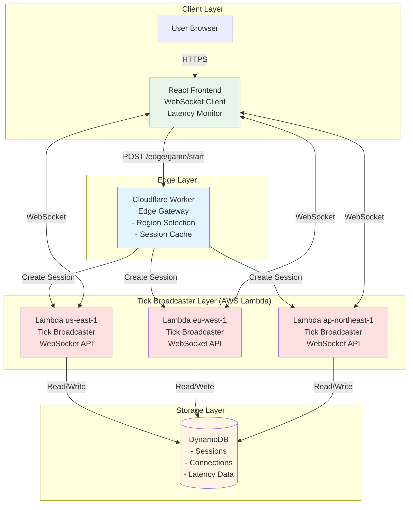
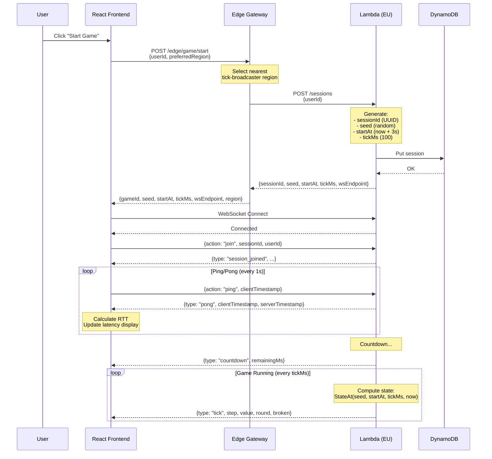
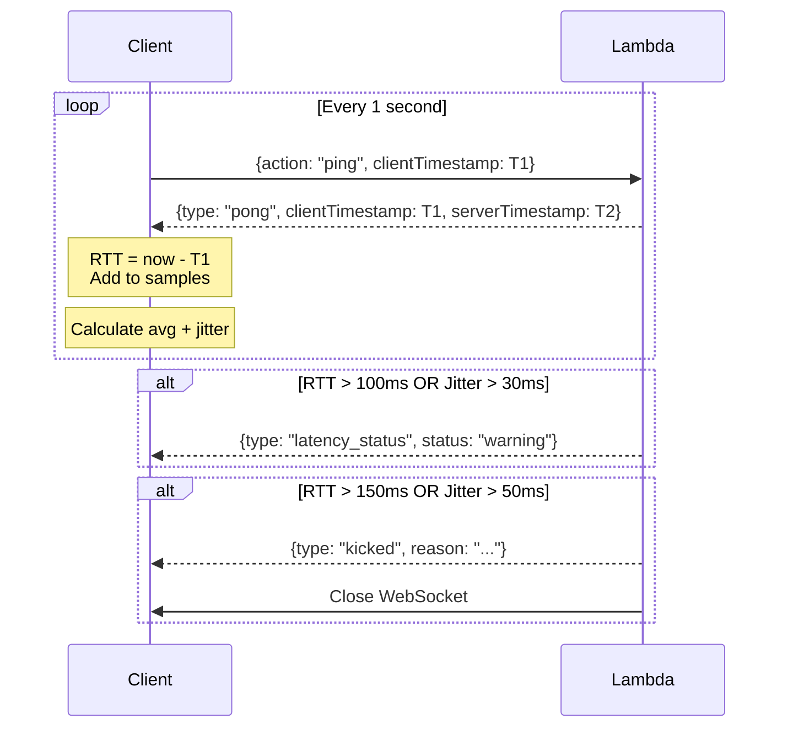

# Distributed Game System Architecture

> [🇷🇺 Русская версия](ARCHITECTURE.ru.md)

## Title & Summary

A **multi-region, edge-optimized game backend** that enables synchronized deterministic gameplay across global players using seed-based pseudo-random algorithms. The system consists of:

- **React Frontend**: Browser-based UI that connects to tick-broadcaster via WebSocket
- **Cloudflare Workers Edge Gateway**: Intelligent routing to nearest tick-broadcaster region
- **AWS Lambda Tick Broadcaster**: Multi-region microbackends that broadcast game ticks to players
- **Go Backend Services**: Stateless services for session management (optional)
- **DynamoDB/Cassandra**: Distributed storage for sessions and connections

The core innovation is **server-side tick broadcasting via Lambda microbackends**: instead of clients computing ticks locally, geographically distributed Lambda functions compute and broadcast ticks to nearby players via WebSocket, ensuring synchronized gameplay with latency enforcement.

---

## High-Level Architecture Overview

The system is designed around five main layers:

1. **Frontend (React)**: Browser-based UI that connects to tick-broadcaster WebSocket and receives real-time tick updates.

2. **Edge Gateway (Cloudflare Workers)**: Routes requests to appropriate tick-broadcaster region based on geography/preference.

3. **Tick Broadcaster (AWS Lambda)**: Multi-region microbackends that:
   - Run in 8+ AWS regions worldwide
   - Compute deterministic game state
   - Broadcast ticks to connected players via WebSocket
   - Measure player latency and enforce thresholds
   - Kick players with poor connections

4. **Go Backend Services (Optional)**: Stateless HTTP services for additional session management and analytics.

5. **Storage Layer**: DynamoDB for Lambda state, Cassandra for long-term persistence.

**Data Flow**: 
```
User → Edge Gateway → Tick Broadcaster (nearest region) → WebSocket → User
                             ↓
                         DynamoDB (session/connection state)
```

---

## Architecture Diagram



### Sequence Diagram: Start Game with Tick Broadcasting



---

## Tick Broadcaster (AWS Lambda) Architecture

### Why Lambda for Tick Broadcasting?

1. **Geographic Distribution**: Deploy to 20+ AWS regions, minimizing latency to players
2. **Auto-scaling**: Handles spikes in player connections automatically
3. **Cost-effective**: Pay only for compute time used
4. **Low Maintenance**: No servers to manage

### Lambda Components

```
┌─────────────────────────────────────────────────────────────────┐
│                    Tick Broadcaster Lambda                       │
├─────────────────────────────────────────────────────────────────┤
│                                                                   │
│  ┌─────────────────────────────────────────────────────────────┐ │
│  │                 API Gateway WebSocket API                   │ │
│  │  - $connect: Player connects                                │ │
│  │  - $disconnect: Player disconnects                          │ │
│  │  - join: Join session                                       │ │
│  │  - ping: Latency measurement                                │ │
│  └─────────────────────────────────────────────────────────────┘ │
│                              │                                   │
│  ┌───────────────────────────┼───────────────────────────────┐  │
│  │                           ▼                               │  │
│  │  ┌─────────────┐  ┌─────────────┐  ┌─────────────────┐    │  │
│  │  │  WebSocket  │  │    HTTP     │  │ Tick Broadcast  │    │  │
│  │  │  Handlers   │  │  Handlers   │  │    Handler      │    │  │
│  │  └─────────────┘  └─────────────┘  └─────────────────┘    │  │
│  │         │                │                │               │  │
│  │         └────────────────┼────────────────┘               │  │
│  │                          ▼                                │  │
│  │  ┌─────────────────────────────────────────────────────┐  │  │
│  │  │              Deterministic Engine                   │  │  │
│  │  │  StateAt(seed, startAt, tickMs, now) → State       │  │  │
│  │  └─────────────────────────────────────────────────────┘  │  │
│  │                          │                                │  │
│  │                          ▼                                │  │
│  │  ┌─────────────────────────────────────────────────────┐  │  │
│  │  │                    DynamoDB                         │  │  │
│  │  │  - Sessions table                                   │  │  │
│  │  │  - Connections table                                │  │  │
│  │  └─────────────────────────────────────────────────────┘  │  │
│  └───────────────────────────────────────────────────────────┘  │
│                                                                   │
└─────────────────────────────────────────────────────────────────┘
```

### Deployed Regions

| Region | Location | Use Case |
|--------|----------|----------|
| us-east-1 | N. Virginia | Americas |
| us-west-2 | Oregon | US West Coast |
| eu-west-1 | Ireland | Europe |
| eu-central-1 | Frankfurt | Central Europe |
| ap-northeast-1 | Tokyo | East Asia |
| ap-southeast-1 | Singapore | Southeast Asia |
| ap-south-1 | Mumbai | South Asia |
| sa-east-1 | São Paulo | South America |

---

## Latency Enforcement System

### Why Latency Thresholds?

Unlike client-side computation, server-broadcasted ticks require low latency for fair gameplay:

- **All players must receive ticks at similar times**
- **High-latency players would see delayed game state**
- **Unstable connections cause stuttering and desync**

### Thresholds Configuration

| Parameter | Default | Description |
|-----------|---------|-------------|
| `MAX_LATENCY_MS` | 150ms | Maximum average RTT before kick |
| `MAX_JITTER_MS` | 50ms | Maximum jitter (std dev) before kick |
| `WARNING_LATENCY_MS` | 100ms | RTT threshold for warning |
| `WARNING_JITTER_MS` | 30ms | Jitter threshold for warning |
| `LATENCY_SAMPLES` | 5 | Samples for rolling average |

### Latency Measurement Flow



### Player States

```
                                    ┌──────────────┐
                                    │  connecting  │
                                    └──────┬───────┘
                                           │
                                           ▼
┌──────────────┐    join session    ┌──────────────┐
│ disconnected │ ◄──────────────────│    ready     │
└──────────────┘                    └──────┬───────┘
       ▲                                   │
       │                                   ▼
       │         kick (high latency) ┌──────────────┐
       └─────────────────────────────│   playing    │
                                     └──────────────┘
```

---

## Request Flows

### Start Game Flow

1. **User Action**: User clicks "Start Game" in React frontend.

2. **Frontend → Edge**: Frontend sends `POST /edge/game/start`:
   ```json
   {
     "userId": "user123",
     "preferredRegion": "eu-west-1"
   }
   ```

3. **Edge Gateway Processing**:
   - Determines nearest tick-broadcaster region
   - Priority: preferredRegion → x-user-region header → Geo (CF country) → Default

4. **Edge → Tick Broadcaster**: Creates session via HTTP:
   ```
   POST https://xxx.execute-api.eu-west-1.amazonaws.com/prod/sessions
   ```

5. **Lambda → DynamoDB**: Stores session configuration

6. **Response Chain**:
   - Lambda → Edge: Session details + WebSocket endpoint
   - Edge → Frontend: Complete response with wsEndpoint

7. **Frontend → Lambda WebSocket**:
   - Connects to `wss://xxx.execute-api.eu-west-1.amazonaws.com/prod`
   - Sends join message
   - Starts receiving tick broadcasts

### Tick Broadcast Flow

The tick broadcaster runs a continuous loop:

   ```typescript
while (running) {
  const now = Date.now();
  
  for (const session of activeSessions) {
    // Compute deterministic state
    const state = stateAt(session.seed, session.startAt, session.tickMs, now);
    
    // Get all connections for this session
    const connections = await getConnectionsBySession(session.sessionId);
    
    // Broadcast tick to all players
    await broadcastToConnections(connections, {
      type: 'tick',
      step: state.step,
      value: state.value,
      round: state.round,
      broken: state.broken,
      serverTimestamp: now,
    });
  }
  
  // Wait until next tick
  await sleep(tickMs);
}
```

---

## Deterministic Engine

The engine is identical across all Lambda regions, ensuring synchronized state:

```typescript
function stateAt(seed: number, startAt: number, tickMs: number, now: number): State {
  const step = Math.floor((now - startAt) / tickMs);
  
  // Simulate from step 0 to current step
  let value = 0, round = 0, broken = false;
  let stepsUntilBreak = computeBreakInterval(seed, round);
  let stepsSinceBreak = 0;
  
  for (let i = 0; i <= step; i++) {
    broken = false;
    stepsSinceBreak++;
    
    if (stepsSinceBreak >= stepsUntilBreak) {
      broken = true;
      round++;
      value = 0;
      stepsUntilBreak = computeBreakInterval(seed, round);
      stepsSinceBreak = 0;
  } else {
      value++;
    }
  }
  
  return { step, value, round, broken };
}
```

**Key Properties**:
- **Deterministic**: Same inputs → Same output
- **Location-independent**: All Lambda regions compute identical states
- **Time-synchronized**: All players receive the same tick at the same time (within latency bounds)

---

## Scalability & Reliability

### Horizontal Scalability

**Lambda Auto-scaling**:
- Scales automatically with player connections
- Reserved concurrency prevents cold starts for tick broadcaster
- Each session is independent

**DynamoDB**:
- On-demand capacity scales with load
- Global tables for multi-region access
- TTL automatically cleans up old data

### Latency Reduction

**Multi-region Deployment**:
- Lambda in 8+ regions
- Edge gateway routes to nearest region
- Players connect to closest tick-broadcaster

**WebSocket Efficiency**:
- Persistent connections (no HTTP overhead per tick)
- Binary message support for efficiency
- Connection pooling at Lambda

### Fault Tolerance

**Lambda Resilience**:
- Automatic failover within region
- Edge can route to alternative region
- Session state in DynamoDB survives Lambda restarts

**Connection Recovery**:
- Client reconnects automatically
- Session state persisted in DynamoDB
- Graceful degradation with latency warnings

---

## Comparison: Client-Side vs Server-Side Ticks

| Aspect | Client-Side (Old) | Server-Side (New) |
|--------|-------------------|-------------------|
| **Tick Computation** | Each client computes locally | Lambda computes and broadcasts |
| **Synchronization** | All clients sync by time | All clients receive same tick |
| **Latency Independence** | Yes (no network for ticks) | No (requires low latency) |
| **Fair Play** | Depends on client honesty | Enforced by server |
| **Cheating Resistance** | Low (client-side logic) | High (server-authoritative) |
| **Connection Required** | Only at start/end | Throughout gameplay |
| **Backend Load** | Minimal | Moderate (WebSocket + broadcasts) |

### When to Use Which

**Client-Side Ticks**:
- Single-player games
- High-latency environments
- Cost-sensitive deployments

**Server-Side Ticks (Lambda)**:
- Multiplayer games requiring sync
- Competitive games needing fair play
- Games requiring server-authoritative state

---

## Deployment

### Prerequisites

- AWS CLI configured
- Node.js 18+
- Serverless Framework 3.x
- Cloudflare Workers (wrangler)

### Deploy Tick Broadcaster

```bash
cd tick-broadcaster
npm install
npm run build
npm run deploy:all  # Deploy to all regions
```

### Deploy Edge Gateway

```bash
cd edge
npm install
npm run deploy
```

### Deploy Frontend

```bash
cd frontend
npm install
npm run build
# Deploy to hosting (Vercel, Netlify, S3, etc.)
```

### Environment Variables

**Tick Broadcaster**:
```yaml
MAX_LATENCY_MS: 150
MAX_JITTER_MS: 50
WARNING_LATENCY_MS: 100
WARNING_JITTER_MS: 30
DEFAULT_TICK_MS: 100
COUNTDOWN_MS: 3000
```

**Edge Gateway**:
```yaml
TICK_US_HTTP: https://xxx.execute-api.us-east-1.amazonaws.com/prod
TICK_US_WS: wss://xxx.execute-api.us-east-1.amazonaws.com/prod
TICK_EU_HTTP: https://xxx.execute-api.eu-west-1.amazonaws.com/prod
TICK_EU_WS: wss://xxx.execute-api.eu-west-1.amazonaws.com/prod
USE_TICK_BROADCASTER: true
```

---

## Future Enhancements

1. **Provisioned Concurrency**: Eliminate Lambda cold starts
2. **Global DynamoDB Tables**: Cross-region session migration
3. **Adaptive Tick Rate**: Adjust tick rate based on player latency
4. **Player Grouping**: Group players by latency for fairer matches
5. **Analytics Pipeline**: Stream events to Kinesis for real-time analytics
6. **Replay System**: Record and replay games from stored ticks
