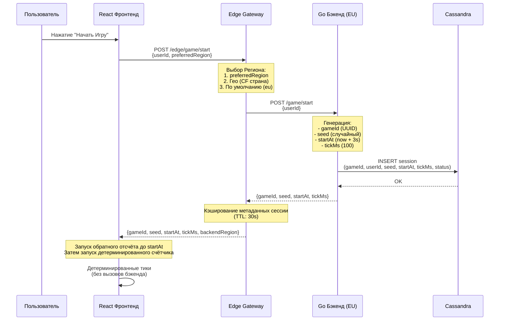

# Архитектура Распределённой Игровой Системы

> [🇬🇧 English version](ARCHITECTURE.md)

## Название и Резюме

**Мультирегиональный, оптимизированный для edge игровой бэкенд**, который обеспечивает синхронизированный детерминированный геймплей для глобальных игроков, используя seed-based псевдослучайные алгоритмы. Система состоит из React фронтенда, edge gateway на Cloudflare Workers для интеллектуальной маршрутизации, stateless Go бэкенд сервисов, развёрнутых в нескольких регионах (EU, US, Asia), и Apache Cassandra как общего распределённого слоя хранения. Основная инновация — **детерминированное выполнение на клиенте**: вместо стриминга каждого игрового тика с бэкенда, система распространяет seed и синхронизированное время старта, позволяя клиентам независимо вычислять идентичные игровые состояния, снижая нагрузку на бэкенд на порядки.

---

## Обзор Высокоуровневой Архитектуры

Система спроектирована вокруг четырёх основных слоёв:

1. **Фронтенд (React)**: UI в браузере, который вызывает edge эндпоинты и запускает детерминированную игровую логику локально, используя параметры seed/startAt/tickMs.

2. **Edge Gateway (Cloudflare Workers)**: Работает на 300+ глобальных точках присутствия, маршрутизирует запросы к соответствующим бэкенд регионам на основе географии/предпочтений пользователя и кэширует метаданные сессий для снижения нагрузки на бэкенд.

3. **Go Бэкенд Сервисы (Мультирегион)**: Stateless HTTP сервисы, развёрнутые в регионах EU, US и Asia. Каждый инстанс обрабатывает создание/завершение сессий и делегирует персистентность Cassandra.

4. **Кластер Cassandra**: Общая распределённая база данных, которая хранит все игровые сессии, обеспечивая долговечность, горизонтальную масштабируемость и кросс-региональную репликацию.

**Поток Данных**: Запрос пользователя → Edge Gateway (решение о маршрутизации) → Региональный Go Бэкенд → Cassandra (персистентность) → Ответ с seed/startAt/tickMs → Фронтенд (детерминированное выполнение).

---

## Диаграмма Архитектуры

```mermaid
graph TB
    subgraph "Слой Клиента"
        User[Браузер Пользователя]
        React[React Фронтенд<br/>Детерминированный Счётчик]
    end
    
    subgraph "Edge Слой"
        Edge[Cloudflare Worker<br/>Edge Gateway<br/>- Маршрутизация по Регионам<br/>- Кэш Сессий]
    end
    
    subgraph "Слой Бэкенда"
        EU[Go Бэкенд<br/>Регион EU<br/>Порт 8081]
        US[Go Бэкенд<br/>Регион US<br/>Порт 8082]
        ASIA[Go Бэкенд<br/>Регион Asia<br/>Порт 8083]
    end
    
    subgraph "Слой Хранения"
        Cassandra[(Кластер Cassandra<br/>Распределённое Хранение<br/>- Сессии<br/>- Кросс-региональная Репликация)]
    end
    
    User -->|HTTP| React
    React -->|POST /edge/game/start| Edge
    React -->|POST /edge/game/exit| Edge
    
    Edge -->|Маршрутизация по Региону| EU
    Edge -->|Маршрутизация по Региону| US
    Edge -->|Маршрутизация по Региону| ASIA
    
    EU -->|Чтение/Запись Сессий| Cassandra
    US -->|Чтение/Запись Сессий| Cassandra
    ASIA -->|Чтение/Запись Сессий| Cassandra
    
    EU -.->|Ответ: seed, startAt, tickMs| Edge
    US -.->|Ответ: seed, startAt, tickMs| Edge
    ASIA -.->|Ответ: seed, startAt, tickMs| Edge
    
    Edge -.->|Ответ: seed, startAt, tickMs, backendRegion| React
    
    style Edge fill:#e1f5ff
    style Cassandra fill:#fff4e1
    style React fill:#e8f5e9
```



### Диаграмма Последовательности: Поток Запуска Игры



---

## Потоки Запросов

### Поток Запуска Игры

1. **Действие Пользователя**: Пользователь вводит userId и нажимает "Начать Игру" в React фронтенде.

2. **Фронтенд → Edge**: Фронтенд отправляет `POST /edge/game/start` с:
   ```json
   {
     "userId": "user123",
     "preferredRegion": "eu"  // опционально
   }
   ```

3. **Обработка Edge Gateway**:
   - **Выбор Региона**: Определяет целевой бэкенд регион используя:
     - Приоритет 1: `preferredRegion` если предоставлен и валиден
     - Приоритет 2: заголовок `x-user-region`
     - Приоритет 3: Географическая маршрутизация (код страны Cloudflare → маппинг региона)
     - Приоритет 4: Регион по умолчанию (например, "eu")
   - **Проверка Кэша**: Опционально проверяет in-memory кэш для недавних сессий (не применимо для старта)

4. **Edge → Бэкенд**: Edge перенаправляет запрос к выбранному региональному Go бэкенду:
   ```
   POST https://eu.api.example.com/game/start
   { "userId": "user123" }
   ```

5. **Обработка Бэкенда**:
   - **Генерация Параметров Игры**:
     - `gameId`: UUID v4
     - `seed`: Криптографически безопасное случайное целое число
     - `startAt`: `Date.now() + 3000` (3 секунды в будущем для обратного отсчёта)
     - `tickMs`: 100 (миллисекунды между тиками)
   - **Создание Сессии**: Вызывает `SessionRepository.CreateSession()` с данными сессии

6. **Бэкенд → Cassandra**: 
   ```sql
   INSERT INTO game_backend.sessions 
   (session_id, user_id, region, seed, start_at, tick_ms, status, started_at)
   VALUES (?, ?, ?, ?, ?, ?, 'active', ?)
   ```

7. **Cassandra → Бэкенд**: Подтверждает запись (консистентность QUORUM)

8. **Бэкенд → Edge**: Возвращает параметры игры:
   ```json
   {
     "gameId": "abc-123-def",
     "seed": 987654321,
     "startAt": 1733850000000,
     "tickMs": 100
   }
   ```

9. **Кэширование Edge**: Edge сохраняет метаданные сессии в in-memory кэше:
   ```typescript
   cache.set({
     gameId: "abc-123-def",
     seed: 987654321,
     startAt: 1733850000000,
     tickMs: 100,
     backendRegion: "eu",
     cachedAt: Date.now()
   })
   ```

10. **Edge → Фронтенд**: Возвращает ответ с добавленным `backendRegion`:
    ```json
    {
      "gameId": "abc-123-def",
      "seed": 987654321,
      "startAt": 1733850000000,
      "tickMs": 100,
      "backendRegion": "eu"
    }
    ```

11. **Выполнение Фронтенда**:
    - **Обратный Отсчёт**: Показывает обратный отсчёт до timestamp `startAt`
    - **Детерминированный Счётчик**: Когда `Date.now() >= startAt`, запускает локальный счётчик, который:
      - Вычисляет `step = floor((now - startAt) / tickMs)`
      - Использует `deterministicRNG(seed, step)` для принятия решений об инкрементах/разрывах
      - Обновляет UI каждые `tickMs` миллисекунд
    - **Без Вызовов Бэкенда**: Счётчик работает полностью на стороне клиента

### Поток Выхода из Игры

1. **Действие Пользователя**: Пользователь нажимает "Выйти из Игры" в React фронтенде.

2. **Фронтенд → Edge**: Отправляет `POST /edge/game/exit`:
   ```json
   {
     "gameId": "abc-123-def",
     "userId": "user123",
     "backendRegion": "eu"  // опционально, если закэшировано
   }
   ```

3. **Обработка Edge Gateway**:
   - **Разрешение Региона**: 
     - Если `backendRegion` предоставлен → использует его
     - Иначе → поиск в кэше по `gameId`
     - Иначе → возвращает ошибку 400 (регион требуется)
   - **Поиск в Кэше**: Получает закэшированную сессию для определения бэкенд региона, если не предоставлен

4. **Edge → Бэкенд**: Перенаправляет к правильному региональному бэкенду:
   ```
   POST https://eu.api.example.com/game/exit
   { "gameId": "abc-123-def", "userId": "user123" }
   ```

5. **Обработка Бэкенда**:
   - **Валидация Сессии**: Вызывает `SessionRepository.GetSession(gameId)`
   - **Обновление Статуса**: Вызывает `SessionRepository.UpdateSession(gameId, "exited")`

6. **Бэкенд → Cassandra**:
   ```sql
   UPDATE game_backend.sessions
   SET status = 'exited'
   WHERE session_id = ?
   IF EXISTS
   ```

7. **Cassandra → Бэкенд**: Подтверждает обновление

8. **Бэкенд → Edge**: Возвращает успех:
   ```json
   { "ok": true }
   ```

9. **Очистка Кэша Edge**: Удаляет сессию из кэша:
   ```typescript
   cache.delete(gameId)
   ```

10. **Edge → Фронтенд**: Возвращает успешный ответ

11. **Очистка Фронтенда**: Останавливает все таймеры, очищает игровое состояние, сбрасывает UI

---

## Объяснение Seed-based Синхронизации

### Основная Концепция

Система достигает **синхронизированного детерминированного поведения** без стриминга каждого игрового тика с бэкенда. Вместо этого бэкенд действует как **координатор**, который распространяет параметры игры, а клиенты независимо вычисляют идентичные игровые состояния, используя детерминированный алгоритм.

### Почему Такой Подход?

1. **Масштабируемость**: Бэкенду не нужно обрабатывать тысячи обновлений тиков в секунду на игру
2. **Независимость от Задержки**: Игроки в разных регионах видят одинаковый паттерн, несмотря на различия в сетевой задержке
3. **Эффективность Пропускной Способности**: Не требуются непрерывные WebSocket/SSE соединения
4. **Отказоустойчивость**: Клиент может продолжать работать, даже если бэкенд временно недоступен

### Детерминированный Алгоритм

Алгоритм комбинирует:
- **Вычисление шага на основе времени**: `step = floor((now - startAt) / tickMs)`
- **Генерация псевдослучайных чисел на основе seed**: `rngValue = deterministicRNG(seed, step)`
- **Детерминированная логика принятия решений**: `shouldBreak = (rngValue % breakProbability === 0)`

### Псевдокод Реализации

```typescript
// Шаг 1: Вычислить текущий шаг на основе прошедшего времени
function getCurrentStep(startAt: number, tickMs: number): number {
  const now = Date.now();
  const elapsed = now - startAt;
  return Math.floor(elapsed / tickMs);
}

// Шаг 2: Детерминированный RNG используя Linear Congruential Generator
function deterministicRNG(seed: number, step: number): number {
  const a = 1664525;      // множитель
  const c = 1013904223;   // инкремент
  const m = Math.pow(2, 32); // модуль
  
  const combined = (seed ^ step) >>> 0; // Комбинируем seed и step
  return Math.abs((a * combined + c) % m);
}

// Шаг 3: Определить, должен ли счётчик разорваться (сброситься)
function shouldBreak(seed: number, step: number, breakProbability: number = 50): boolean {
  const rngValue = deterministicRNG(seed, step);
  return rngValue % breakProbability === 0;
}

// Шаг 4: Логика игрового тика (запускается каждые tickMs миллисекунд)
function handleTick(gameState: GameState) {
  const step = getCurrentStep(gameState.startAt, gameState.tickMs);
  
  if (shouldBreak(gameState.seed, step, 50)) {
    // Сброс счётчика (1 из 50 шанс, детерминированно)
    gameState.counter = 0;
    log(`[BREAK] Шаг ${step}, Счётчик сброшен`);
  } else {
    // Инкремент счётчика
    gameState.counter++;
  }
}
```

### Гарантия Детерминизма

**Ключевое Свойство**: При одинаковых `(seed, startAt, tickMs)` и одинаковом значении `step`, все клиенты производят идентичные результаты.

- **Одинаковый seed**: Все игроки получают одинаковый seed с бэкенда
- **Одинаковый startAt**: Все игроки начинают отсчёт с одинакового timestamp
- **Одинаковое вычисление шага**: `step = floor((now - startAt) / tickMs)` производит одинаковое значение для одинакового времени
- **Одинаковый вывод RNG**: `deterministicRNG(seed, step)` — чистая функция → одинаковые входы = одинаковый выход
- **Одинаковые решения**: Условия разрыва детерминированы → одинаковое значение RNG = одинаковое решение о разрыве

### Пример Временной Шкалы

```
Время: 0ms     → Бэкенд возвращает: seed=987654321, startAt=1000, tickMs=100
Время: 1000ms  → Игра начинается, step=0,  RNG(987654321, 0)  = 1234567890, counter++
Время: 1100ms  → step=1,  RNG(987654321, 1)  = 2345678901, counter++
Время: 1200ms  → step=2,  RNG(987654321, 2)  = 3456789012, counter++
Время: 1300ms  → step=3,  RNG(987654321, 3)  = 4567890123, counter++
Время: 5000ms  → step=40, RNG(987654321, 40) = 9876543210, % 50 == 0 → BREAK, counter=0
```

Все игроки с одинаковым seed видят разрыв на шаге 40, независимо от их местоположения или задержки.

---

## Соображения Масштабируемости и Надёжности

### Горизонтальная Масштабируемость

**Stateless Go Бэкенды**:
- Каждый бэкенд инстанс stateless (нет хранения сессий в памяти)
- Может масштабироваться горизонтально, добавляя больше инстансов на регион
- Балансировщик нагрузки распределяет запросы между инстансами
- **Почему масштабируется**: Нет общего состояния между инстансами → линейное масштабирование

**Распределённое Хранение Cassandra**:
- **Партиционирование**: Сессии распределены по узлам по `session_id` (первичный ключ)
- **Репликация**: Каждый регион может иметь локальные реплики + кросс-региональная репликация
- **Производительность Записи**: Оптимизирована для высокой пропускной способности записи (идеально для создания сессий)
- **Производительность Чтения**: Вторичный индекс на `user_id` обеспечивает эффективные запросы по пользователю
- **Почему масштабируется**: Добавляйте узлы → увеличивайте ёмкость линейно

### Сниженная Нагрузка на Бэкенд

**Детерминированное Выполнение на Клиенте**:
- Бэкенд обрабатывает только: создание сессий, завершение сессий, запросы метаданных
- **Нет стриминга тиков в реальном времени**: Устраняет тысячи запросов в секунду на игру
- **Пример**: 10,000 одновременных игр × 10 тиков/секунду = 100,000 req/s сэкономлено
- **Почему эффективно**: Бэкенд действует как координатор, а не процессор реального времени

### Мультирегиональное Развёртывание

**Снижение Задержки**:
- Edge gateway маршрутизирует к ближайшему бэкенд региону
- Региональные бэкенды снижают время оборота
- **Пример**: Пользователь в Таиланде → Asia бэкенд (50ms) vs EU бэкенд (300ms)

**Доступность**:
- Если один регион падает, edge может маршрутизировать к другому региону
- Репликация Cassandra обеспечивает доступность данных между регионами
- **Почему надёжно**: Нет единой точки отказа

### Преимущества Cassandra

**Высокая Пропускная Способность Записи**:
- Оптимизирована для нагрузок с большим количеством записей (создание сессий — это много записей)
- Нет сложных джойнов или транзакций → быстрые записи
- **Почему подходит**: Игровые сессии — это простые key-value записи

**Кросс-Региональная Репликация**:
- Может реплицировать данные между датацентрами
- Обеспечивает долговечность, даже если весь регион падает
- **Почему надёжно**: Данные переживают региональные сбои

**Горизонтальное Масштабирование**:
- Добавляйте узлы для увеличения ёмкости
- Не требуется простой для масштабирования
- **Почему масштабируется**: Распределённая архитектура с нуля

### Преимущества Edge Слоя

**Близость к Пользователям**:
- Cloudflare Workers работают на 300+ глобальных локациях
- Время отклика sub-10ms на edge
- **Почему быстро**: Код работает близко к пользователям

**Интеллектуальная Маршрутизация**:
- Edge может маршрутизировать на основе географии, задержки или нагрузки
- Снижает нагрузку на бэкенд, кэшируя часто запрашиваемые данные
- **Почему эффективно**: Снижает ненужные вызовы бэкенда

**Будущий Хостинг Микропроцессов**:
- Edge может хостить лёгкое игровое состояние (Durable Objects)
- Координация в реальном времени без обращения к бэкенду
- **Почему расширяемо**: Основа для более сложных игр

---

## Возможные Расширения

### 1. Слой Кэша Redis

**Цель**: Снизить нагрузку чтения Cassandra для горячих сессий

**Реализация**:
- Добавить кластер Redis между Go бэкендами и Cassandra
- Кэшировать часто запрашиваемые сессии (TTL: 5 минут)
- Write-through кэш: запись в Redis и Cassandra

**Преимущества**:
- Быстрее поиск сессий (sub-миллисекунда vs 10-50ms для Cassandra)
- Снижает нагрузку запросов Cassandra
- Может служить хранилищем сессий для edge gateway

### 2. Потоковая Передача Событий (Kafka/NATS)

**Цель**: Аналитика в реальном времени и обработка событий

**Реализация**:
- Бэкенд публикует события: `game.started`, `game.exited`, `game.break`
- Kafka/NATS стримит события в аналитический пайплайн
- Дашборды в реальном времени, таблицы лидеров, обнаружение мошенничества

**Преимущества**:
- Разделяет аналитику от основной игровой логики
- Включает функции реального времени без влияния на производительность игры
- Историческое воспроизведение событий для отладки

### 3. Игровые Комнаты на Edge (Durable Objects)

**Цель**: Хостить лёгкое игровое состояние на edge для координации мультиплеера

**Реализация**:
- Использовать Cloudflare Durable Objects для stateful игровых комнат
- Edge координирует обновления в реальном времени между игроками
- Бэкенд обрабатывает только персистентность и тяжёлые вычисления

**Преимущества**:
- Задержка координации sub-10ms
- Снижает нагрузку на бэкенд для функций реального времени
- Включает новые типы игр (мультиплеер, турниры)

### 4. Продвинутый Выбор Региона

**Цель**: Оптимизировать маршрутизацию на основе задержки, нагрузки или стоимости

**Реализация**:
- На основе задержки: Измерять RTT до каждого региона, маршрутизировать к самому быстрому
- На основе нагрузки: Запрашивать эндпоинты здоровья бэкенда, маршрутизировать к наименее загруженному
- Гибрид: Комбинировать метрики задержки + нагрузки + стоимости

**Преимущества**:
- Лучший пользовательский опыт (ниже задержка)
- Лучшее использование ресурсов (балансировка нагрузки)
- Оптимизация стоимости (маршрутизация к более дешёвым регионам)

### 5. Миграция Сессий

**Цель**: Перемещать активные сессии между регионами для балансировки нагрузки

**Реализация**:
- Бэкенд обнаруживает перегруженный регион
- Мигрирует метаданные сессии в другой регион
- Edge обновляет маршрутизацию для мигрированных сессий

**Преимущества**:
- Динамическая балансировка нагрузки
- Изящно обрабатывает всплески трафика
- Лучшее использование ресурсов

### 6. Система Детерминированного Воспроизведения

**Цель**: Отладка и анализ поведения игры

**Реализация**:
- Хранить все параметры игры (seed, startAt, tickMs) в Cassandra
- Алгоритм воспроизведения: Перезапустить детерминированную логику с сохранёнными параметрами
- Сравнить результаты воспроизведения с фактическими логами игры

**Преимущества**:
- Отладка проблем синхронизации
- Анализ паттернов игры
- Валидация корректности детерминизма

