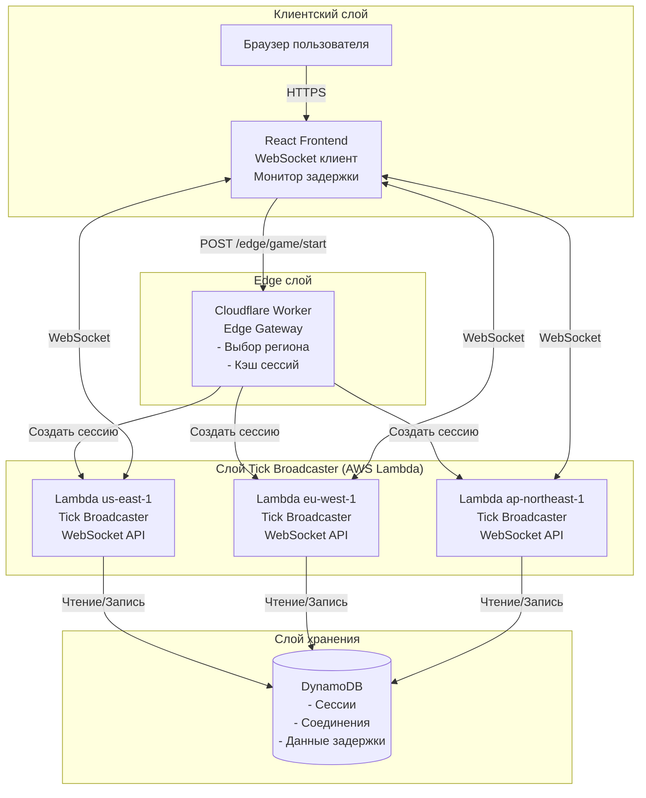
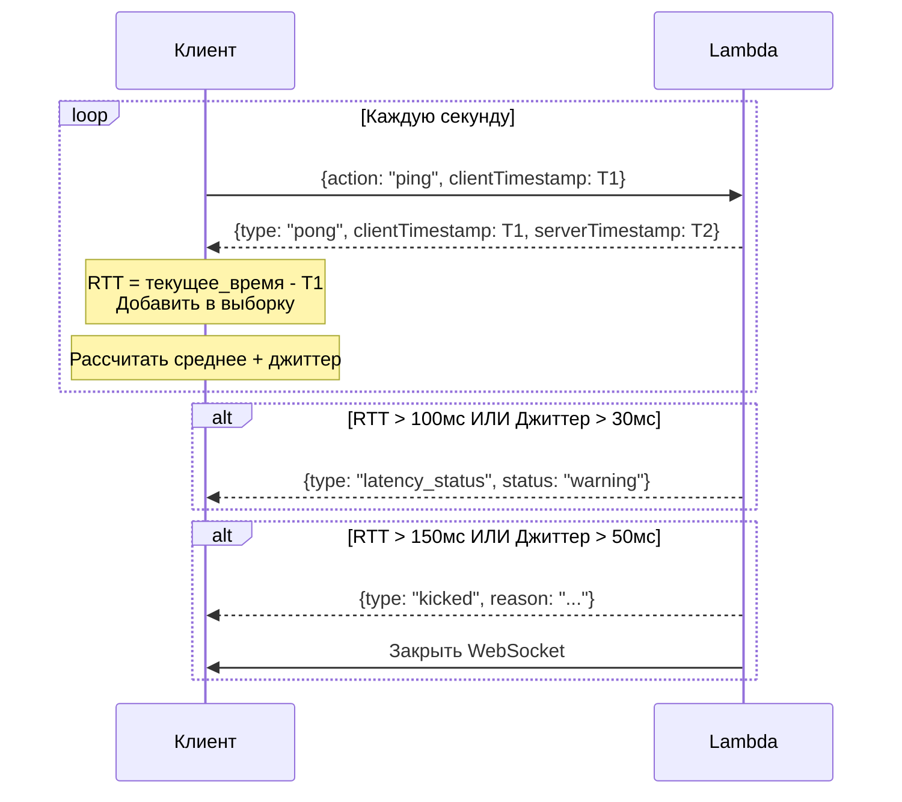

# Архитектура распределённой игровой системы

> [🇬🇧 English version](ARCHITECTURE.md)

## Название и краткое описание

**Мультирегиональный, оптимизированный для edge-вычислений игровой бэкенд**, который обеспечивает синхронизированный детерминированный геймплей для глобальных игроков с использованием алгоритмов псевдослучайных чисел на основе seed. Система состоит из:

- **React Frontend**: Браузерный UI, подключающийся к tick-broadcaster через WebSocket
- **Cloudflare Workers Edge Gateway**: Интеллектуальная маршрутизация к ближайшему региону tick-broadcaster
- **AWS Lambda Tick Broadcaster**: Мультирегиональные микробэкенды, транслирующие игровые тики игрокам
- **Go Backend Services**: Stateless-сервисы для управления сессиями (опционально)
- **DynamoDB/Cassandra**: Распределённое хранилище для сессий и соединений

Ключевая инновация — **серверная трансляция тиков через Lambda-микробэкенды**: вместо локального вычисления тиков клиентами, географически распределённые Lambda-функции вычисляют и транслируют тики ближайшим игрокам через WebSocket, обеспечивая синхронизированный геймплей с контролем задержки.

---

## Обзор архитектуры высокого уровня

Система состоит из пяти основных слоёв:

1. **Frontend (React)**: Браузерный UI, подключающийся к WebSocket tick-broadcaster и получающий обновления тиков в реальном времени.

2. **Edge Gateway (Cloudflare Workers)**: Маршрутизирует запросы к соответствующему региону tick-broadcaster на основе географии/предпочтений.

3. **Tick Broadcaster (AWS Lambda)**: Мультирегиональные микробэкенды, которые:
   - Работают в 8+ регионах AWS по всему миру
   - Вычисляют детерминированное состояние игры
   - Транслируют тики подключённым игрокам через WebSocket
   - Измеряют задержку игроков и контролируют пороговые значения
   - Отключают игроков с плохим соединением

4. **Go Backend Services (опционально)**: Stateless HTTP-сервисы для дополнительного управления сессиями и аналитики.

5. **Слой хранения**: DynamoDB для состояния Lambda, Cassandra для долгосрочного хранения.

**Поток данных**: 
```
Пользователь → Edge Gateway → Tick Broadcaster (ближайший регион) → WebSocket → Пользователь
                                       ↓
                                   DynamoDB (состояние сессий/соединений)
```

---

## Диаграмма архитектуры



---

## Система контроля задержки

### Зачем нужны пороговые значения задержки?

В отличие от клиентских вычислений, транслируемые сервером тики требуют низкой задержки для честного геймплея:

- **Все игроки должны получать тики примерно в одно время**
- **Игроки с высокой задержкой видят устаревшее состояние игры**
- **Нестабильные соединения вызывают заикания и рассинхронизацию**

### Конфигурация порогов

| Параметр | По умолчанию | Описание |
|----------|--------------|----------|
| `MAX_LATENCY_MS` | 150мс | Максимальное среднее RTT до отключения |
| `MAX_JITTER_MS` | 50мс | Максимальный джиттер (станд. откл.) до отключения |
| `WARNING_LATENCY_MS` | 100мс | Порог RTT для предупреждения |
| `WARNING_JITTER_MS` | 30мс | Порог джиттера для предупреждения |
| `LATENCY_SAMPLES` | 5 | Количество измерений для скользящего среднего |

### Поток измерения задержки



### Состояния игрока

```
                                    ┌──────────────┐
                                    │ подключение  │
                                    └──────┬───────┘
                                           │
                                           ▼
┌──────────────┐    вход в сессию   ┌──────────────┐
│  отключён    │ ◄──────────────────│   готов      │
└──────────────┘                    └──────┬───────┘
       ▲                                   │
       │                                   ▼
       │         кик (высокая задержка) ┌──────────────┐
       └────────────────────────────────│   в игре     │
                                        └──────────────┘
```

---

## Развёрнутые регионы

| Регион | Расположение | Использование |
|--------|--------------|---------------|
| us-east-1 | Северная Вирджиния | Америка |
| us-west-2 | Орегон | Западное побережье США |
| eu-west-1 | Ирландия | Европа |
| eu-central-1 | Франкфурт | Центральная Европа |
| ap-northeast-1 | Токио | Восточная Азия |
| ap-southeast-1 | Сингапур | Юго-Восточная Азия |
| ap-south-1 | Мумбаи | Южная Азия |
| sa-east-1 | Сан-Паулу | Южная Америка |

---

## Потоки запросов

### Поток запуска игры

1. **Действие пользователя**: Пользователь нажимает "Start Game" в React-приложении.

2. **Frontend → Edge**: Frontend отправляет `POST /edge/game/start`:
   ```json
   {
     "userId": "user123",
     "preferredRegion": "eu-west-1"
   }
   ```

3. **Обработка Edge Gateway**:
   - Определяет ближайший регион tick-broadcaster
   - Приоритет: preferredRegion → заголовок x-user-region → Гео (страна CF) → По умолчанию

4. **Edge → Tick Broadcaster**: Создаёт сессию через HTTP:
   ```
   POST https://xxx.execute-api.eu-west-1.amazonaws.com/prod/sessions
   ```

5. **Lambda → DynamoDB**: Сохраняет конфигурацию сессии

6. **Цепочка ответов**:
   - Lambda → Edge: Детали сессии + WebSocket endpoint
   - Edge → Frontend: Полный ответ с wsEndpoint

7. **Frontend → Lambda WebSocket**:
   - Подключается к `wss://xxx.execute-api.eu-west-1.amazonaws.com/prod`
   - Отправляет сообщение о присоединении
   - Начинает получать трансляции тиков

### Поток трансляции тиков

Tick broadcaster выполняет непрерывный цикл:

   ```typescript
while (running) {
  const now = Date.now();
  
  for (const session of activeSessions) {
    // Вычислить детерминированное состояние
    const state = stateAt(session.seed, session.startAt, session.tickMs, now);
    
    // Получить все соединения для этой сессии
    const connections = await getConnectionsBySession(session.sessionId);
    
    // Транслировать тик всем игрокам
    await broadcastToConnections(connections, {
      type: 'tick',
      step: state.step,
      value: state.value,
      round: state.round,
      broken: state.broken,
      serverTimestamp: now,
    });
  }
  
  // Ждать следующего тика
  await sleep(tickMs);
}
```

---

## Детерминированный движок

Движок идентичен во всех регионах Lambda, обеспечивая синхронизированное состояние:

```typescript
function stateAt(seed: number, startAt: number, tickMs: number, now: number): State {
  const step = Math.floor((now - startAt) / tickMs);
  
  // Симулировать от шага 0 до текущего шага
  let value = 0, round = 0, broken = false;
  let stepsUntilBreak = computeBreakInterval(seed, round);
  let stepsSinceBreak = 0;
  
  for (let i = 0; i <= step; i++) {
    broken = false;
    stepsSinceBreak++;
    
    if (stepsSinceBreak >= stepsUntilBreak) {
      broken = true;
      round++;
      value = 0;
      stepsUntilBreak = computeBreakInterval(seed, round);
      stepsSinceBreak = 0;
  } else {
      value++;
    }
  }
  
  return { step, value, round, broken };
}
```

**Ключевые свойства**:
- **Детерминированность**: Одинаковые входные данные → Одинаковый результат
- **Независимость от расположения**: Все регионы Lambda вычисляют идентичные состояния
- **Временная синхронизация**: Все игроки получают один и тот же тик в одно время (в пределах задержки)

---

## Сравнение: клиентские vs серверные тики

| Аспект | Клиентские (старое) | Серверные (новое) |
|--------|---------------------|-------------------|
| **Вычисление тиков** | Каждый клиент вычисляет локально | Lambda вычисляет и транслирует |
| **Синхронизация** | Клиенты синхронизируются по времени | Все получают одинаковый тик |
| **Независимость от задержки** | Да (нет сети для тиков) | Нет (требуется низкая задержка) |
| **Честная игра** | Зависит от честности клиента | Контролируется сервером |
| **Защита от читов** | Низкая (клиентская логика) | Высокая (авторитетный сервер) |
| **Требуется соединение** | Только в начале/конце | На протяжении всей игры |
| **Нагрузка на бэкенд** | Минимальная | Умеренная (WebSocket + трансляции) |

### Когда использовать какой подход

**Клиентские тики**:
- Однопользовательские игры
- Среды с высокой задержкой
- Экономные развёртывания

**Серверные тики (Lambda)**:
- Многопользовательские игры, требующие синхронизации
- Соревновательные игры, требующие честной игры
- Игры, требующие авторитетного серверного состояния

---

## Развёртывание

### Требования

- Настроенный AWS CLI
- Node.js 18+
- Serverless Framework 3.x
- Cloudflare Workers (wrangler)

### Развёртывание Tick Broadcaster

```bash
cd tick-broadcaster
npm install
npm run build
npm run deploy:all  # Развернуть во всех регионах
```

### Развёртывание Edge Gateway

```bash
cd edge
npm install
npm run deploy
```

### Развёртывание Frontend

```bash
cd frontend
npm install
npm run build
# Развернуть на хостинге (Vercel, Netlify, S3 и т.д.)
```

### Переменные окружения

**Tick Broadcaster**:
```yaml
MAX_LATENCY_MS: 150
MAX_JITTER_MS: 50
WARNING_LATENCY_MS: 100
WARNING_JITTER_MS: 30
DEFAULT_TICK_MS: 100
COUNTDOWN_MS: 3000
```

**Edge Gateway**:
```yaml
TICK_US_HTTP: https://xxx.execute-api.us-east-1.amazonaws.com/prod
TICK_US_WS: wss://xxx.execute-api.us-east-1.amazonaws.com/prod
TICK_EU_HTTP: https://xxx.execute-api.eu-west-1.amazonaws.com/prod
TICK_EU_WS: wss://xxx.execute-api.eu-west-1.amazonaws.com/prod
USE_TICK_BROADCASTER: true
```

---

## Будущие улучшения

1. **Provisioned Concurrency**: Устранение холодных стартов Lambda
2. **Глобальные таблицы DynamoDB**: Межрегиональная миграция сессий
3. **Адаптивная частота тиков**: Регулировка частоты тиков в зависимости от задержки игроков
4. **Группировка игроков**: Группировка игроков по задержке для более честных матчей
5. **Аналитический конвейер**: Потоковая передача событий в Kinesis для аналитики в реальном времени
6. **Система повторов**: Запись и воспроизведение игр из сохранённых тиков
